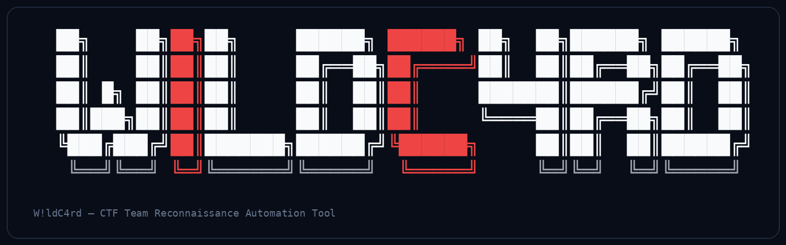
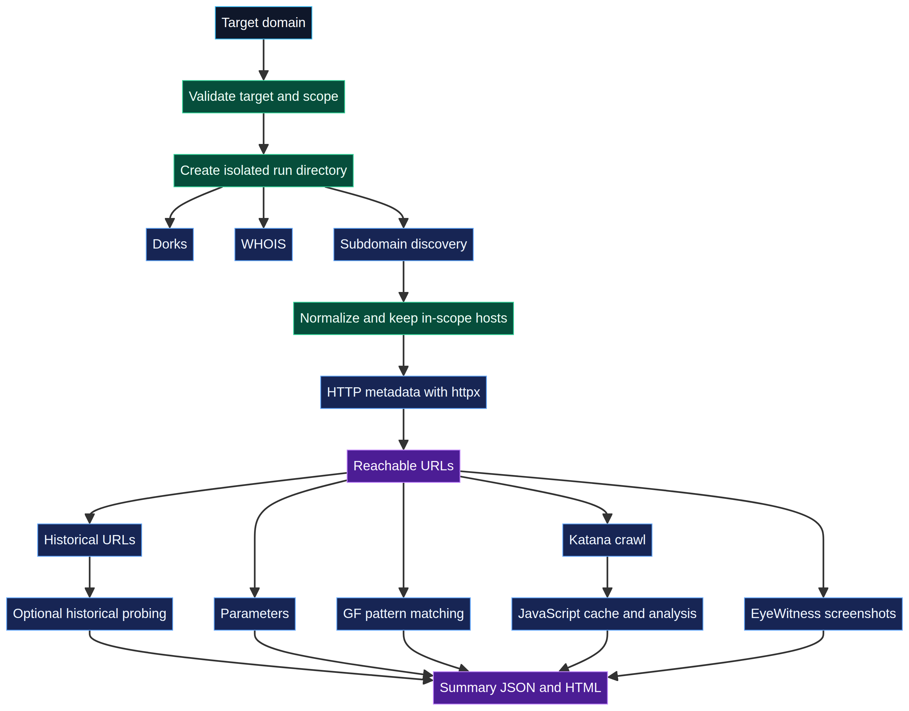
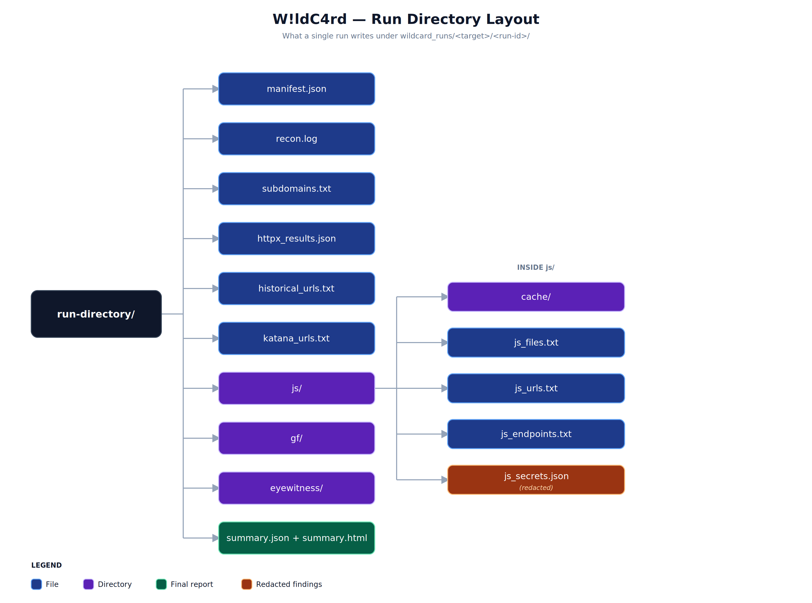

# W!ldC4rd

<p align="center">
  <strong>Organized reconnaissance for authorized security testing</strong><br>
  <sub>Scope-aware • Resumable • Structured outputs • Safe-by-default</sub>
</p>

<p align="center">
  <a href="#quick-start"></a>
  <a href="#safety-model"></a>
  <a href="#output-layout"></a>
  <a href="#legal-notice"></a>
</p>

<p align="center">
  
</p>

> **W!ldC4rd is for authorized asset discovery and reconnaissance only.**
> Obtain written permission and define the allowed scope before running it against any target.

## Contents

- [Overview](#overview)
- [Workflow](#workflow)
- [Quick Start](#quick-start)
- [Advanced Usage](#advanced-usage)
- [Output Layout](#output-layout)
- [Safety Model](#safety-model)
- [External Tools](#external-tools)
- [Installation Details](#installation-details)
- [Testing](#testing)
- [Privacy and Reporting](#privacy-and-reporting)
- [Legal Notice](#legal-notice)

## Overview

The banner above is printed by `wildcard.py` on startup. W!ldC4rd is a Python-based reconnaissance orchestrator for CTF teams, internal security teams, and authorized bug-bounty work. It chains passive discovery, optional HTTP metadata collection, historical URL collection, crawling, and local JavaScript analysis into one repeatable workflow — and writes the result as clean, reviewable evidence instead of a folder of mixed, stale text files.

The project is intentionally **not an exploitation framework**: no Nuclei templates, no brute force, no credential testing, no automated exploitation.

**Highlights**
- Scope-enforced — a host only moves downstream if it matches the target's root domain
- Resumable — every run is tracked in a `manifest.json` you can pick back up later
- Structured output — a machine-readable `summary.json` plus a human-readable `summary.html`
- Safe defaults — historical-URL probing and browser opening are both opt-in, not automatic
- Secrets are redacted — potential findings are stored as fingerprints, never raw values

## Workflow

<p align="center">
  
</p>

Each run gets a fresh directory, applies the target scope before anything downstream happens, keeps Google dorks separate from real URLs, and writes a machine-readable manifest as it goes.

| Stage | What it does | Main output |
|---|---|---|
| Dorks | Builds Google queries for manual review; never probes them | `dorks.txt`, `google_dorks.txt` |
| WHOIS | Collects WHOIS info when `whois` is installed | `whois.txt` |
| Subdomains | Merges passive sources, keeps only in-scope hosts | `subdomains.txt`, `subdomains_sources.json` |
| HTTP metadata | Status, title, redirects, technologies, content length | `httpx_results.json` |
| Historical URLs | Collects and normalizes Wayback and GAU URLs | `historical_urls.txt` |
| Historical probing | Optional; only with `--probe-history` | `historical_httpx_results.json` |
| Parameters | Extracts normalized parameter URLs | `params.txt`, `parameter_names.txt` |
| GF patterns | Matches patterns against real URLs only | `gf/*.txt` |
| Katana | Crawls a bounded set of in-scope, reachable targets | `katana_urls.txt`, `js_files.txt` |
| JavaScript analysis | Downloads and caches each JS file once, extracts URLs/endpoints, redacts secrets | `js/`, `js_secrets.json` |
| EyeWitness | Optional screenshots of clean target URLs | `eyewitness/` |
| Summary | Structured and browser-friendly reports | `summary.json`, `summary.html` |

## Quick Start

### 1. Clone the repository

```bash
https://github.com/0xFat7y/WildC4rd.git
cd wildcard
```

### 2. Install the system and external tools

The installer is idempotent — it skips tools that are already available and warns (without failing) on optional tools it can't install.

```bash
chmod +x install_tools.sh
bash install_tools.sh
```

If the installer added Go to your `PATH`, open a new terminal or reload your shell profile:

```bash
source ~/.bashrc
```

### 3. Install the Python dependency

```bash
python3 -m pip install -r requirements.txt
```

On distributions that protect the system Python, use a virtual environment instead:

```bash
python3 -m venv .venv
. .venv/bin/activate
python -m pip install -r requirements.txt
```

### 4. Run it

```bash
python3 wildcard.py
```

```text
Target domain: example.com
```

No flags are required. Results land under `wildcard_runs/example.com/<run-id>/`.

## Advanced Usage

The interactive command above is the recommended starting point. For scripts, CI, or repeatable runs, the same program takes CLI options:

```bash
python3 wildcard.py --target example.com --profile standard
python3 wildcard.py --target example.com --profile passive --dry-run
python3 wildcard.py --target example.com --skip-stages eyewitness,gf
python3 wildcard.py --target example.com --stages dorks,subdomains,httpx,summary
```

Profiles: conservative `passive`, balanced `standard`, slower and more thorough `deep`.

Historical URL probing and browser tabs are both off by default — opt in explicitly:

```bash
python3 wildcard.py --target example.com --probe-history
python3 wildcard.py --target example.com --open-browser
```

Resume an interrupted run from its manifest:

```bash
python3 wildcard.py --resume wildcard_runs/example.com/20260828_120000_ab12cd/manifest.json
```

See every option with `python3 wildcard.py --help`.

## Output Layout

<p align="center">
    
</p>

Every run is isolated — an old output file is never treated as proof that the current stage succeeded.

```text
wildcard_runs/
└── example.com/
    ├── latest_run.txt
    └── 20260828_120000_ab12cd/
        ├── manifest.json
        ├── recon.log
        ├── dorks.txt
        ├── google_dorks.txt
        ├── whois.txt
        ├── subdomains.txt
        ├── subdomains_sources.json
        ├── httpx_results.json
        ├── reachable_urls.txt
        ├── live_subdomains.txt
        ├── screenshot_targets.txt
        ├── historical_urls.txt
        ├── historical_httpx_results.json
        ├── active_historical_endpoints.txt
        ├── params.txt
        ├── parameter_names.txt
        ├── gf/
        │   ├── xss.txt
        │   ├── sqli.txt
        │   ├── ssrf.txt
        │   └── ...
        ├── katana_urls.txt
        ├── js_files.txt
        ├── js/
        │   └── cache/
        ├── js_urls.txt
        ├── js_endpoints.txt
        ├── js_secrets.json
        ├── eyewitness/
        ├── summary.json
        └── summary.html
```

`summary.json` is the canonical machine-readable report; `summary.html` is a lightweight view for quick human review. `recon.log` records command and stage status, and `manifest.json` tracks the target, scope, configuration, and resume state.

## Safety Model

Safety here means **scope first**. Every hostname or URL is normalized and checked against the configured root domain before it's written downstream or requested — `example.com.evil.tld` will never match a scope of `example.com`, and userinfo or explicit ports are rejected during normalization.

- TLS verification is on by default; `--insecure-tls` exists only for controlled lab environments.
- Google dorks are stored for manual review and never converted into URLs or probed.
- Timeouts are bounded, subprocesses run in their own process group, and cleanup terminates the whole group.
- JavaScript downloads are size-limited, cached per run, and fetched only for in-scope URLs.
- Potential secrets are stored as **redacted values plus fingerprints**, not raw credentials — rotate anything confirmed, immediately.

## External Tools

All external tools are optional. A missing tool just skips its stage with a warning — it doesn't stop the run.

| Tool | Purpose | Project |
|---|---|---|
| `whois` | WHOIS lookup | System package |
| `subfinder` | Passive subdomain discovery | [projectdiscovery/subfinder](https://github.com/projectdiscovery/subfinder) |
| `amass` | Passive asset discovery | [owasp-amass/amass](https://github.com/owasp-amass/amass) |
| `assetfinder` | Related domain/subdomain discovery | [tomnomnom/assetfinder](https://github.com/tomnomnom/assetfinder) |
| `httpx` | HTTP reachability and metadata | [projectdiscovery/httpx](https://github.com/projectdiscovery/httpx) |
| `waybackurls` | Wayback URL collection | [tomnomnom/waybackurls](https://github.com/tomnomnom/waybackurls) |
| `gau` | Historical URL collection | [lc/gau](https://github.com/lc/gau) |
| `gf` | Pattern matching against URLs | [tomnomnom/gf](https://github.com/tomnomnom/gf) |
| `katana` | Bounded web crawling and JS discovery | [projectdiscovery/katana](https://github.com/projectdiscovery/katana) |
| `xnLinkFinder` | Additional local JS link extraction | [xnl-h4ck3r/xnLinkFinder](https://github.com/xnl-h4ck3r/xnLinkFinder) |
| `EyeWitness` | Optional screenshots and HTML report | [RedSiege/EyeWitness](https://github.com/RedSiege/EyeWitness) |

v2 performs scope-aware URL normalization and deduplication itself, so dorks and synthetic URLs never reach the historical-URL or HTTP-probing pipeline.

## Installation Details

**Supported environments:** Debian/Ubuntu/Kali-style Linux (the installer needs `sudo` for system packages). WSL works if the required Linux packages and a working browser environment are present. Python 3.9+ and Go are recommended for the external tools.

**Manual Go install**, if you'd rather skip the installer:

```bash
go install github.com/projectdiscovery/subfinder/v2/cmd/subfinder@latest
go install github.com/owasp-amass/amass/v4/...@master
go install github.com/tomnomnom/assetfinder@latest
go install github.com/projectdiscovery/httpx/cmd/httpx@latest
go install github.com/tomnomnom/waybackurls@latest
go install github.com/lc/gau/v2/cmd/gau@latest
go install github.com/tomnomnom/gf@latest
go install github.com/projectdiscovery/katana/cmd/katana@latest
```

Make sure `$HOME/go/bin` is on your `PATH`.

**EyeWitness** is optional: the installer tries a system package first, then falls back to the official source repo. If it's unavailable, the workflow continues and `eyewitness_summary.json` is simply not created.

## Testing

```bash
python3 -m py_compile wildcard.py
python3 test_wildcard_v2.py
python3 wildcard.py --target example.com --profile passive --dry-run
```

The dry run validates the target, creates an isolated run directory, writes the manifest, and records the stage plan — no external tools or network requests.

## Privacy and Reporting

Run directories can contain sensitive asset names, response metadata, screenshots, and URLs — treat them as security-sensitive evidence. Don't commit `wildcard_runs/`, `.venv/`, cached JavaScript, or screenshots to a public repo:

```gitignore
wildcard_runs/
.venv/
__pycache__/
*.pyc
```

## Legal Notice

This project is for authorized security testing, defensive asset inventory, CTF labs, and permitted bug-bounty reconnaissance. Do not run it against systems you don't own or don't have explicit written authorization to test. You're responsible for complying with applicable laws, program rules, rate limits, and third-party terms of service.

## Credits

W!ldC4rd integrates open-source projects listed under [External Tools](#external-tools) — review their licenses and documentation before use.
